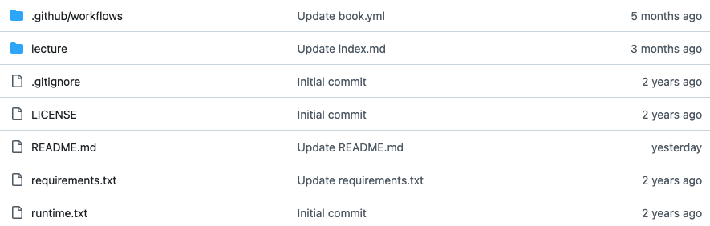

# Getting Started With GitHub

To create and publish your course website, we will be relying on GitHub, a web-based platform that provides hosting and storage services for software and data. 

## Goals

This chapter aims to include the following goals. Do check back here later and see if the lesson has appropriately addressed the stated goals!

1. Understand the benefits of using GitHub
2. Learn how to set up your GitHub account
3. Learn how to set up an online repository (your course)
4. Explore the structure of the course template
5. Learn how to edit existing files

## What's GitHub and Why Should We Use It?

As already mentioned, GitHub is a web-based platform for storing, organizing, and managing projects. It uses repositories (or "repos"), which are similar to folders on your computer, where you can store a variety of file types and nested directories. Repositories are where you’ll organize your project files, including code, assets, and documentation.

Here is an example of the repository for the course template you'll be working with:

GitHub is based on "Git", a version control system used in nearly every large software project. While GitHub can be hosted on a local machine or network (e.g., if the access to the hosted software or data should be restricted), we'll use the public GitHub server, i.e., the [web-based version of GitHub](https://github.com). In essence, this allows us to openly share and for other people to make copies or download our projects, e.g., for collaborative development or issue tracking. It further allows for feedback on our courses or the reporting of possible errors people may have encountered.

GitHub helps prevent the common problem of losing important work or creating disorganized files. Instead of manually managing multiple versions (e.g., project_working_copy_1.txt), Git tracks every change made to a file. Its two main advantages are:
- **Version Control**: Git records all changes, allowing you to revert to previous versions if needed.
- **Collaboration**: Multiple users can work on the same project, submit changes, and review them before integrating them into the main project.

## Next Section: 

In the next section you will learn how to create your own GitHub account.

